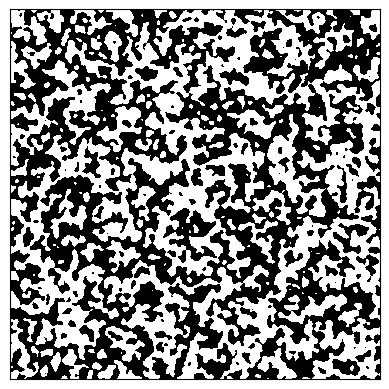
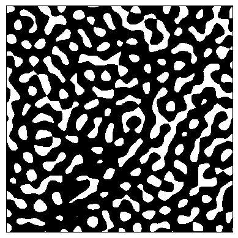
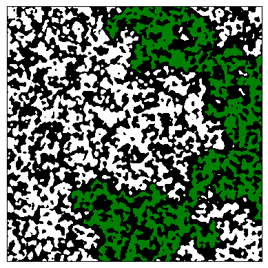
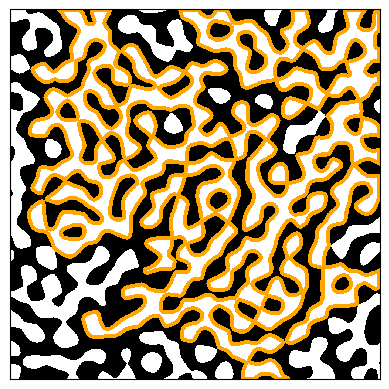

# Gaussian Field Excursions

## Overview
Gaussian Field Excursions is a small python module for simulating two-dimensional Gaussian fields and plotting features of their excursion sets.

### Gaussian fields
A planar Gaussian field can be described mathematically as a (random) function $f:\mathbb{R}^2\to\R$ such that its values at any finite collection of points are jointly Gaussian (i.e. normally distributed). The fields considered in this module are also assumed to be

- **smooth**: with probability one, $f$ is continuously differentiable,
- **stationary**: the distribution of $f$ is invariant under translation,
- **normalised**: at each point $x$, $f(x)$ has mean zero and variance one.

Further mathematical details on such models may be found in the textbook by Adler and Taylor [[1]](#reference-1).

### Excursion sets
The (upper)-excursion set of a field $f$ is defined to be the set of points where it exceeds some threshold $\ell$; in mathematical notation
$$
    \{x\in\mathbb{R}^2\;|\;f(x)\geq \ell\}.
$$
This is often abbreviated to $\{f\geq\ell\}$.

<p align="center">
  
  
  <br>
  <em>
    Figure 1. Excursion sets (in white) for Gaussian fields with different distributions and thresholds.
  </em>
</p>

 The geometry and topology of such excursion sets are widely studied in pure mathematics and statistics [[2]](#reference-2) [[3]](#reference-3). There is particular interest in the geometry of large/unbounded components of the excursion set [[4]](#reference-4) which is relevant to the mathematical theory of percolation [[5]](#reference-5).

 ### Functionality
 This module provides functions for simulating and plotting excursion sets of different families of Gaussian fields, as well as highlighting the largest connected component of the excursion set and its boundary.

 <p align="center">
  
  
  <br>
  <em>
    Figure 2. Excursion sets (in white) with the largest component highlighted in green (left) and the boundary of the largest component highlighted in orange (right).
  </em>
</p>

Simulations of fields in this module are created using [GSTools](https://geostat-framework.readthedocs.io/projects/gstools/en/stable/contents.html).

## Installation

```bash
python -m venv .venv
pip install -r requirements.txt
```

## Minimal example

```python
from gaussian_field_excursions import plot_excursion, simulate_field

field = simulate_field(
    x_size=10,
    y_size=5,
    pixel_density=10,
    covariance="bf",
)

plot_excursion(field, boundary=True)
```

## Available covariance models
The module supports the following four covariance structures:

### Random plane wave
The random plane wave has covariance
$$\mathrm{Cov}[f(x),f(y)]=J_0(\lvert x-y\rvert)$$
where $J_0$ denotes the zero-th Bessel function of the first kind. This function can be thought of heuristically as a random superposition of sine waves uniformly distributed over all directions. This model is a special case of _monochromatic random waves_ which are widely studied in mathematical physics [[3]](#reference-3). An important source of motivation for studying this model comes from a conjecture by Michael Berry that high-energy Laplace eigenfunctions on generic Riemannian manifolds can be well-approximated by monochromatic random waves [[6]](#reference-6). This field can be simulated by passing the argument `covariance="rpw"` to `simulate_field`.

### Bargmann-Fock field
The Bargmann-Fock field has covariance
$$\mathrm{Cov}[f(x),f(y)]=\exp\big(-\lvert x-y\rvert^2/2\big).$$
The study of this field is motivated by the fact that it describes the local scaling limit of a canonical measure on random homogeneous polynomials [[5, Section 2]](#reference-2). It is also of great interest in percolation theory as it has properties which make it amenable to classical arguments (namely, fast correlation decay and the FKG property). See [[5]](#reference-5) for further details. This field can be simulated using the argument `covariance="bf"`.

### Matérn field
The Matérn field with parameter $\nu>0$ has covariance function
$$\mathrm{Cov}[f(x),f(y)]=\frac{2^{1-\nu}}{\Gamma(\nu)}\big(\sqrt{\nu}\lvert x-y\rvert\big)^\nu K_\nu\big(\sqrt{\nu}\lvert x-y\rvert\big),$$
where $\Gamma$ is the Gamma function and $K_\nu$ denotes the modified Bessel function of the second kind. This family of fields is widely used in machine learning [[7, Chapter 4]](#reference-7). To simulate this field, the function `simulate_field` requires the argument `covariance="matern"` and a value for the parameter `nu`.

### Rational quadratic
The rational quadratic field with parameter $\beta>0$ has covariance
$$\mathrm{Cov}[f(x),f(y)]=(1+\beta^{-1}\lvert x-y\rvert^2)^{-\beta}.$$
This model has been used as a canonical example of a strongly correlated field (when $\beta<d/2$) in studying percolation [[8]](#reference-8). This field may be simulated by specifying `covariance="rq"` and a value for `beta` in the function `simulate_field`.

## Coordinate and length-scale conventions
The scale of the simulated field is determined by the arguments `x_size`, `y_size` and `pixel_density` which are passed to `simulate_field`. `x_size` and `y_size` specify the overall size of the simulation in the horizontal and vertical directions, measured in the natural units of the field (i.e. the coordinate units of $x$ and $y$ in the above covariance functions). The `pixel_density` argument then specifies the ratio of the length of each pixel on the simulated grid to the length of each natural unit. (So for example, a unit square will contain `pixel_density**2` total grid points.) This parameterisation allows the user to choose `x_size` and `y_size` with a low `pixel_density` to quickly test simulations for overall scale, before increasing `pixel_density` to get higher quality simulations.

## References

<a id="reference-1"></a>
[1] Adler, R. J., & Taylor, J. E. (2007). _Random fields and geometry_. Springer New York. [DOI](https://doi.org/10.1007/978-0-387-48116-6)

<a id="reference-2"></a>
[2] Adler, R. J. (2008). _Some new random field tools for spatial analysis_. Stochastic Enviromental Research and Risk Assessment. [Preprint](https://doi.org/10.48550/arXiv.0805.1031)

<a id="reference-3"></a>
[3] Wigman, I. (2024). _On the nodal structures of random fields: a decade of results_. Journal of Applied and Computational Topology. [DOI](https://doi.org/10.1007/s41468-023-00140-x)

<a id="reference-4"></a>
[4] McAuley, M. (2026). _Three central limit theorems for the unbounded excursion component of a Gaussian field_. Annals of Applied Probability. [Preprint](https://doi.org/10.48550/arXiv.2403.03033)

<a id="reference-5"></a>
[5] Beliaev, D. (2023). _Smooth Gaussian fields and percolation_. Probability Surveys. [DOI](https://doi.org/10.1214/23-PS24)

<a id="reference-6"></a>
[6] Berry, M. V. (1977). _Regular and irregular semiclassical wavefunctions_. Journal of Physics A: Mathematical and General. [DOI](10.1088/0305-4470/10/12/016)

<a id="reference-7"></a>
[7] Rasmussen, C. E., & Williams, C. K. I., (2005). _Gaussian Processes for Machine Learning_. The MIT press. [DOI](https://doi.org/10.7551/mitpress/3206.001.0001)

<a id="reference-8"></a>
[8] Muirhead, S. (2024) _Percolation of strongly correlated Gaussian fields II. Sharpness of the phase transition_. The Annals of Probability. [DOI](https://doi.org/10.1214/23-AOP1673).

## Licence

This project is available under the [MIT Licence](LICENSE).
